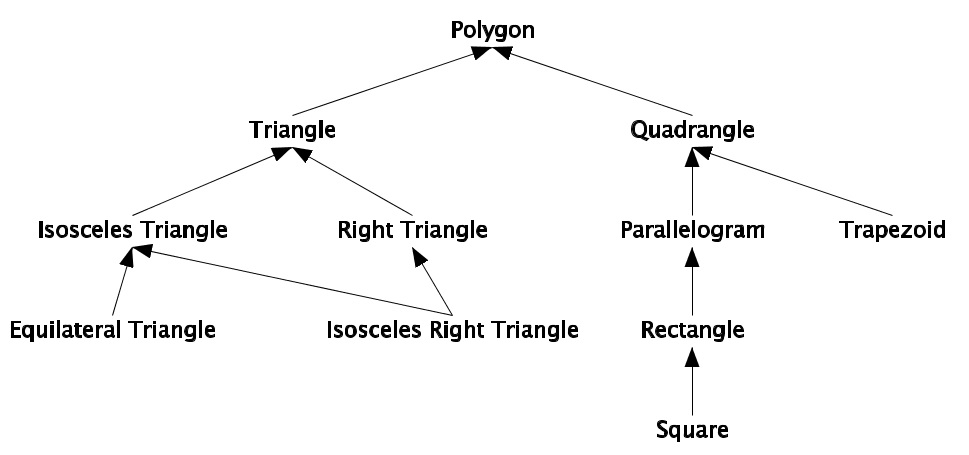

# Inheritance, abstraction and interfaces in C#
## Prerequisites
- Install [Git](https://git-scm.com/book/en/v2/Getting-Started-Installing-Git)
- Install [.NET](https://docs.microsoft.com/en-us/dotnet/)
### How to use it:

```
C:\>git clone https://github.com/maria1226/Poligon.git
C:\>cd .\Poligon\Poligon1\
C:\>dotnet build 
C:\>dotnet run
```
## Exercise
Make a program that calculates the parameter and area of different types of polygons.

